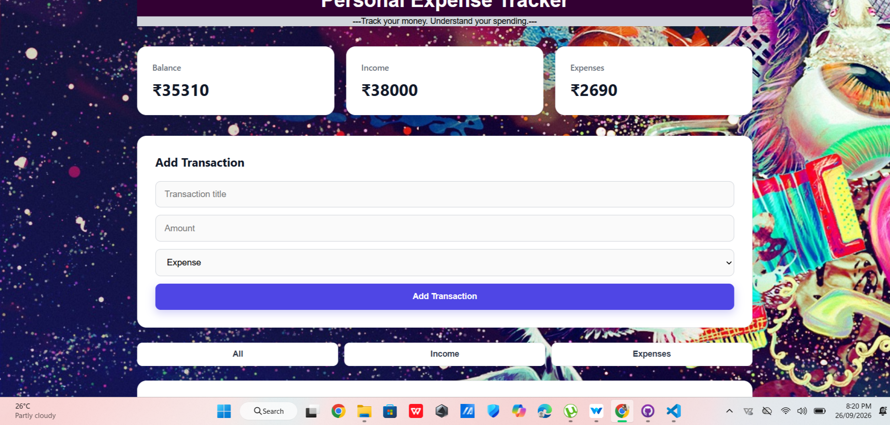

# Money Mate 💰
## Preview


A responsive personal expense tracker built using HTML, CSS, and JavaScript.

## Features

- Add income and expense transactions
- Automatically calculate total income
- Automatically calculate total expenses
- Automatically calculate current balance
- Filter transactions by All, Income, and Expenses
- Delete transactions
- Responsive and clean user interface
- Dynamic DOM manipulation

## Technologies Used

- HTML5
- CSS3
- JavaScript (ES6+)

## JavaScript Concepts Used

- Arrays and Objects
- DOM Manipulation
- Event Listeners
- `filter()`
- `reduce()`
- Functions
- Arrow Functions
- Template Literals
- Dynamic Element Creation

## Project Structure

```text
Money Mate/
├── index.html
├── style.css
└── js/
    └── app.js
